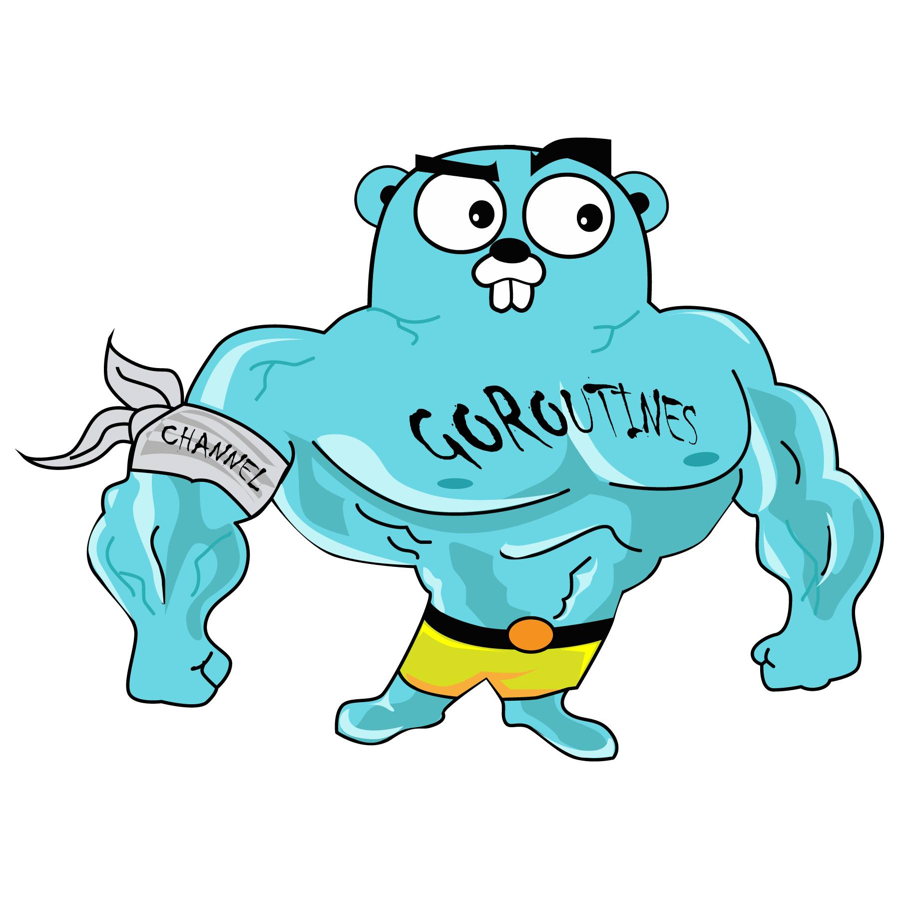

# REST API Server example
Ladies and gentlemen, once upon a time I asked a candidate for Golang Junior Developer position to create a simple Golang REST API server doing something useful (anything useful).

I won't show his code here :) But as a result I realized I don't have my answer to this question :) So, here it is!

This is Golang REST API server example including the following features:
- based on high performance, extensible, minimalist Go web framework - Echo - <https://echo.labstack.com> 
- made with Clean Architecture in mind (controller -> service -> repository)
- has services that work with both PostgreSQL database (user CRUD) and Google Cloud Storage (file upload/download)
- includes service & controller go tests based on database mocks auto-generated with go:generate and mockery (<https://github.com/vektra/mockery>)
- Postman tests included aswell
- config based on envconfig (<https://github.com/kelseyhightower/envconfig>)
- made relatively fast :) but with love :)
- more details in my Youtube video that I'm going to make tomorrow :)
